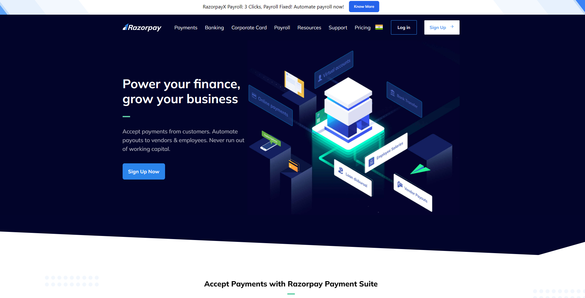

# Razorpay Clone with Tailwind CSS

Welcome to my Razorpay Clone project, which is my Tailwind CSS first project! This project aims to replicate the Razorpay user interface and functionality while showcasing my skills in front-end development.

## Features

- **Responsive Design**: The entire application is designed to be fully responsive, ensuring a seamless experience across different devices and screen sizes.

- **Authentic Razorpay Look**: I've paid close attention to recreating the familiar and aesthetic Razorpay interface, including server channels, chat, and user roles.

## Technologies Used

- **Tailwind CSS**: This project was created using Tailwind CSS, a utility-first CSS framework, to build a responsive and visually appealing user interface.

